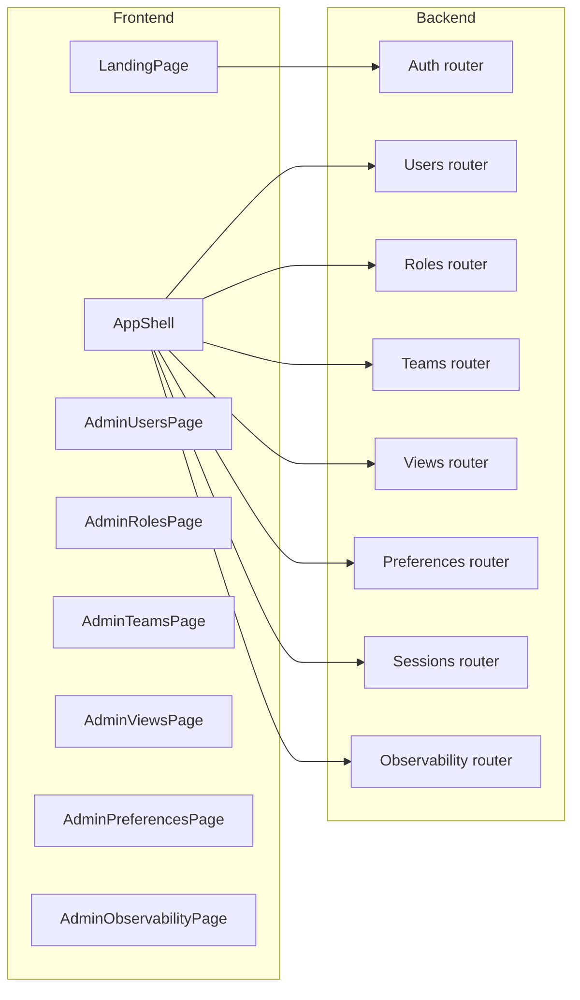

# Admin, RBAC, Sessions, Views, Preferences, Email, and Observability Plan

## 1. High-level architecture

- **Single stack**: All Admin, auth, RBAC, session, and observability features live in this app:
  - Frontend: React + TypeScript + Vite, React Router, TanStack Query.
  - Backend: FastAPI + Pydantic + SQLModel/SQLAlchemy (DB-ready but can start in-memory).
- **Core concepts**:
  - `User`, `Role`, `Team`, `Session`, `View`, `UserPreference`, `AuditLog`, `ObservabilityEvent`.
  - RBAC driven by `Role` + per-view permission flags (e.g., `canManageUsers`, `canViewObservability`).
  - Sessions link Google-signed-in identities to backend `User` and drive observability (who did what, when, in which view).
- **Data flow overview**:

## 2. Auth, user model, and RBAC foundation

- **2.1. Solidify auth context**
  - Keep current Google one-tap client-side sign-in, but extend `AuthContext` user shape with `role`, `teamIds`, and a backend `userId` field (once we have a users API).
  - Add a light `useRequireRole(requiredRole)` helper to guard Admin routes in the frontend.
- **2.2. Backend `User`, `Role`, `Team` models**
  - In a new module (e.g., `backend/models/admin.py`), define SQLModel models:
    - `User`: `id`, `email`, `name`, profile fields (job title, department, company, location, team_id, picture_url, created_at, updated_at, is_active, role_id`).
    - `Role`: `id`, `name` (Admin, PM, Editor, Viewer), `description`, `permissions` (JSON or structured booleans for major modules).
    - `Team`: `id`, `name`, `description`, `default_role_id`.
  - Add Pydantic schemas for create/update/read where needed.
- **2.3. Users, roles, teams routers**
  - Create dedicated routers (e.g., `backend/routers/users.py`, `roles.py`, `teams.py`) with DB-ready in-memory stores:
    - Users:
      - `GET /api/admin/users` (list, with filters for team, role, status).
      - `POST /api/admin/users` (create or first-time bootstrap from Google profile).
      - `PATCH /api/admin/users/{id}` (update profile, role, team, status).
    - Roles:
      - `GET /api/admin/roles`, `POST /api/admin/roles`, `PATCH /api/admin/roles/{id}`.
    - Teams:
      - `GET /api/admin/teams`, `POST /api/admin/teams`, `PATCH /api/admin/teams/{id}`.
  - Include basic RBAC checks in routers (e.g., only `Admin` can change roles).
- **2.4. Session management model**
  - Add `Session` model (e.g., `backend/models/sessions.py`): `id`, `user_id`, `created_at`, `last_activity_at`, `ip`, `user_agent`, `status` (active, revoked).
  - Create `/api/admin/sessions` router for:
    - `GET /api/admin/sessions` (list active sessions, filter by user).
    - `POST /api/admin/sessions/revoke` (bulk revoke by ids or user).
  - Hook a `touch_session(session_id)` helper into a dependency that runs on every authenticated backend call later.

## 3. Frontend Admin: Users, Roles, Teams

- **3.1. Navigation and route structure**
  - Add an Admin entry in the AppShell header dropdown pointing to `/app/admin`.
  - Under `/app/admin`, use nested routes:
    - `/app/admin/users`
    - `/app/admin/roles`
    - `/app/admin/teams`
    - `/app/admin/views`
    - `/app/admin/preferences`
    - `/app/admin/observability`
- **3.2. Users page**
  - Implement `AdminUsersPage` under `frontend/src/modules/admin-users/`:
    - Top filters: search by name/email, filter by role, team, status.
    - Tabbed layout: Users, Roles & Permissions, Teams, Active Sessions (matching your earlier vision).
    - User table columns: Name, Email, Role, Team, Last Active, Status, actions (View, Edit, Deactivate).
    - Side drawer or modal for editing a user (change role/team, toggle active, view basic session info).
  - Use TanStack Query hooks backed by `/api/admin/users` and `/api/admin/sessions`.
- **3.3. Roles page**
  - Implement `AdminRolesPage`:
    - List of roles with description and key permissions summarized (e.g., checkboxes for "Manage Users", "View Observability", "Manage Integrations").
    - Role detail/edit drawer to adjust permission toggles.
    - Create-role flow (for future custom roles) but start with seeded four: Admin, PM, Editor, Viewer.
- **3.4. Teams page**
  - Implement `AdminTeamsPage`:
    - List of teams with member counts and default role.
    - Drawer to edit membership (multi-select of users) and default role.
    - Use hooks for `/api/admin/teams` and `/api/admin/users` to show which users belong where.

## 4. View Management and User Preferences

- **4.1. View management backend**
  - Define `View` model: `id`, `name`, `key` (e.g., `workflow-builder`, `query-studio`, `integrations-hub`, `admin-users`, etc.), `description`, and per-role defaults (e.g., visible, pinned, default_page).
  - Router `/api/admin/views`:
    - `GET /api/admin/views` (list all views and default configs).
    - `PATCH /api/admin/views/{id}` (admin-only to change visibility/pinning defaults).
- **4.2. User preferences backend**
  - Define `UserPreference` model: `id`, `user_id`, `theme`, `time_zone`, `density`, `default_view_id`, and a generic JSON `settings` field.
  - Router `/api/admin/preferences`:
    - `GET /api/admin/preferences/me` (current user’s preferences).
    - `PATCH /api/admin/preferences/me` (update own preferences).
- **4.3. Frontend: Views and Preferences UI**
  - `AdminViewsPage`:
    - Table/grid of all views with columns for key, description, default visibility per role.
    - Toggles to control which roles can access each view (ultimately feeding RBAC).
  - `AdminPreferencesPage`:
    - Per-user settings UI: theme (light/dark/system), density, time zone, default landing view.
    - A small card in the user dropdown to quickly change theme and default view.
  - Tie `default_view_id` into the router: on login, redirect to that view instead of always `/app` dashboard.

## 5. Email configuration (as an integration)

- **5.1. Email integration model extension**
  - Extend existing `IntegrationConfig` backend model (or add a subtype) for `email` provider:
    - Fields: `provider` (e.g., `sendgrid`, `ses`, `smtp`), `credentials_reference`, `from_name`, `from_email`.
  - Tag these integrations with `category = "email"`.
- **5.2. Email as part of Integrations Hub UI**
  - In `IntegrationsHubPage`, add an "Email" category filter and card layout for email configurations.
  - Configure flows for creating/updating email integrations via the existing wizard, with email-specific fields.
- **5.3. Using email settings**
  - Prepare backend helpers (e.g., `email_service.py`) that:
    - Resolve an email integration by ID.
    - Construct provider clients (left as no-op or stub until real credentials exist).
  - Use email integration IDs in admin flows (e.g., choose which integration to use for system notifications or invites).

## 6. Sessions, observability, and audit logging

- **6.1. Observability models**
  - Define `AuditLog` model: `id`, `timestamp`, `user_id`, `session_id`, `action`, `resource_type`, `resource_id`, `metadata` (JSON), and `ip`.
  - Define `ObservabilityEvent` model for broader metrics: `id`, `timestamp`, `user_id` (optional), `session_id` (optional), `category` (`auth`, `workflow`, `integration`, etc.), `name`, `value`, `metadata`.
- **6.2. Logging hooks**
  - Add a small `audit` module with helpers like `log_action(user, session_id, action, resource_type, resource_id, metadata)`.
  - Wire these into key routers:
    - When user signs in, create `Session` and log `user.login`.
    - When roles change, log `user.role_changed` with old/new values.
    - When integrations are added/edited, log `integration.updated`.
- **6.3. Observability router**
  - Router `/api/admin/observability`:
    - `GET /api/admin/observability/audit-logs` with filters for `user_id`, `action`, `resource_type`, date range.
    - `GET /api/admin/observability/metrics` returning summarized counts (e.g., logins by day, active sessions, changes by module).
- **6.4. Frontend Observability UI**
  - `AdminObservabilityPage` under `frontend/src/modules/admin-observability/` with a tabbed layout:
    - **Audit Logs**: searchable table of actions (user, action, resource, timestamp), with filters and drill-down.
    - **Sessions**: embedded view of active sessions per user (reusing `/api/admin/sessions`).
    - **Metrics**: simple charts or stat cards (for now, basic counts and trend lines using a light chart lib or custom components).
  - Connect filters to query parameters so links are shareable (e.g., "show me logs for this user").

## 7. RBAC wiring across modules

- **7.1. Permission model**
  - In `Role.permissions`, store booleans (or a JSON object) like:
    - `manageUsers`, `manageRoles`, `manageTeams`, `viewObservability`, `manageIntegrations`, `viewWorkflows`, `editWorkflows`.
  - Extend auth token (or client-side user state) to include resolved permissions for the current user.
- **7.2. Frontend enforcement**
  - Implement a small `Can` component or hook:
    - Usage: `<Can permission="manageUsers">...protected UI...</Can>` or `useHasPermission('viewObservability')`.
  - Hide or disable navigation items and actions when permission is missing.
- **7.3. Backend enforcement**
  - Add a FastAPI dependency that resolves the current `User` and `Role` from the session (initially stub using email mapping if no DB yet).
  - Use this dependency in admin routers to enforce permissions server-side, returning 403 for unauthorized operations.

## 8. Implementation sequencing

1. **Foundation**: finalize models and routers for `User`, `Role`, `Team`, `Session` (in-memory or SQLModel without full DB yet).
2. **Admin UI shell**: add `/app/admin` routes and basic Users/Roles/Teams pages with fake data.
3. **Real data wiring**: plug Users/Roles/Teams pages into the new FastAPI routers with TanStack Query hooks.
4. **Views & Preferences**: implement backend models, then Admin Views and Preferences pages, and wire default landing view.
5. **Email integration**: extend `IntegrationConfig` and Integrations Hub for email category.
6. **Observability & audit logs**: add models, logging helpers, routers, and the Admin Observability UI (logs + basic metrics).
7. **RBAC hardening**: add permission flags to `Role`, create `Can` hook/component, and apply across Admin and core modules.

Throughout, reuse existing UI components and styling patterns and keep backend routers small and focused, matching the patterns already used for projects, workflows, integrations, and environments.