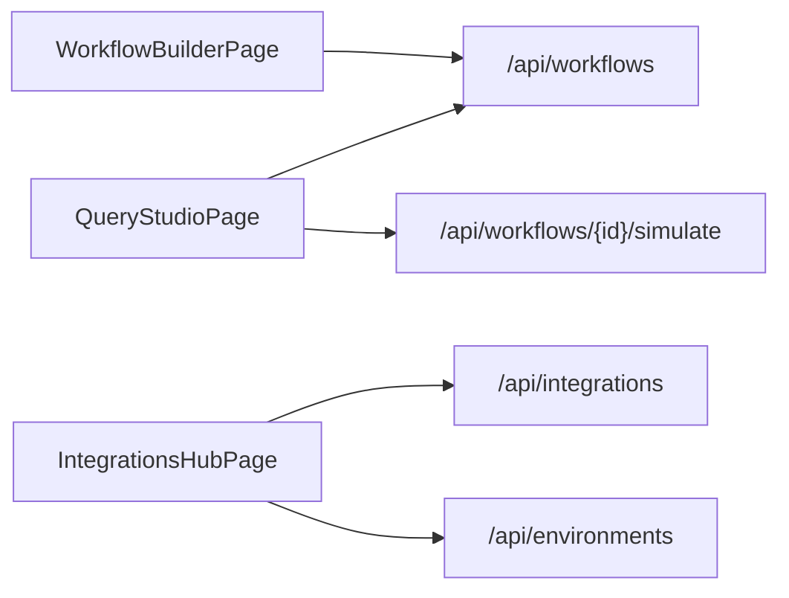

# Build Core RAG Studio UX (Workflow Builder, Query Studio, Integrations Hub)

## Goals

- **Workflow Builder UI**: Create a modern, drag-and-drop workflow builder for RAG pipelines, backed by the existing `WorkflowDefinition` models and APIs.
- **Query Studio**: Implement an interactive query playground to execute workflows, inspect traces, and compare retrieval strategies (initially stubbed via backend).
- **Integrations Hub**: Build an admin console section to manage reusable integrations and bind them to environments, using `IntegrationConfig` and `EnvironmentConfig`.
- **Backend wiring**: Connect these UIs to the FastAPI backend via typed API clients, using the existing routers and models as the source of truth.

## Architecture & Data Flow

- **Frontend** (React + TS in `frontend/`):
  - Use React Router for SPA navigation between `WorkflowBuilderPage`, `QueryStudioPage`, and `IntegrationsHubPage`.
  - Use a state management solution (React Query or Zustand) to fetch and cache projects, workflows, integrations, and environments.
  - Organize code by feature modules: `workflow-builder`, `query-studio`, `admin-integrations`.
- **Backend** (FastAPI in `backend/`):
  - Continue using `WorkflowDefinition`, `WorkflowNode`, `WorkflowEdge` (`backend/routers/workflows.py`) for workflow definitions.
  - Use `IntegrationConfig` and `EnvironmentConfig` for integrations and environment mappings.
  - Add execution and trace endpoints later; for now, stub Query Studio with mocked responses returned by FastAPI.

### High-Level Flow (Mermaid)

## Module 1: Workflow Builder UI

- **1.1. Frontend structure**
  - Add routing entries for `/workflow-builder` and `/projects/:projectId/workflows/:workflowId`.
  - Create components under `frontend/src/modules/workflow-builder/`:
    - `WorkflowBuilderPage` – wraps the builder with project/workflow selection.
    - `WorkflowCanvas` – visual canvas for nodes and edges (use a library like React Flow).
    - `NodePalette` – sidebar with draggable node types.
    - `NodeConfigPanel` – right-side panel showing configuration for the selected node.
    - `WorkflowVersionBar` – header/footer with version info and actions (save, publish).
- **1.2. Node and edge modeling (frontend)**
  - Define TypeScript interfaces mirroring backend models in a shared types file (e.g. `frontend/src/api/types.ts`):
    - `WorkflowDefinition`, `WorkflowNode`, `WorkflowEdge`, `NodeType` (from backend `NodeType`).
  - Ensure these align with `backend/routers/workflows.py` to avoid divergence.
- **1.3. API client hooks**
  - Implement API client functions in `frontend/src/api/workflows.ts`:
    - `listWorkflows(projectId?)` → `GET /api/workflows` (filter client-side or extend API later).
    - `createWorkflow(definition)` → `POST /api/workflows`.
    - `updateWorkflow(definition)` → initially reuse `POST` or add `PUT` when backend is extended.
  - Wrap these with React Query hooks (`useWorkflows`, `useSaveWorkflow`) for caching and mutation.
- **1.4. Canvas behavior**
  - Integrate React Flow (or similar) into `WorkflowCanvas`:
    - Map `WorkflowNode` to nodes on canvas with positions from `node.position`.
    - Map `WorkflowEdge` to edges.
    - Support adding nodes by drag-and-drop from `NodePalette`.
    - Support connecting nodes visually, updating edges list.
  - Wire selection events to `NodeConfigPanel`.
- **1.5. Node configuration UX**
  - For each node type, define config schema in TS (a union of discriminated types) that maps to `config: Dict[str, Any]` on the backend.
  - Implement form sections per category:
    - Retrieval nodes: provider selection (vector/graph/sql), top-k, filters.
    - Temporal nodes: time range, snapshot, versioning options.
    - LLM nodes: model reference, temperature, policies.
    - Guardrail nodes: policies, thresholds, approval hooks.
  - Persist changes to the `config` field and save workflow via API.
- **1.6. Versioning UX**
  - Add a non-destructive "Save Draft" and "Publish" flow:
    - "Save Draft" updates the workflow definition via API.
    - "Publish" toggles `is_active` and (later) triggers governance approvals.
  - Display current version and `is_active` status in `WorkflowVersionBar`.

## Module 2: Query Studio

- **2.1. Frontend structure**
  - Add route `/query-studio`.
  - Create components under `frontend/src/modules/query-studio/`:
    - `QueryStudioPage` – main layout.
    - `QueryInputPanel` – query text, project, environment, workflow selectors.
    - `TraceTabs` – tabs for vector hits, metadata matches, graph traversal, temporal filters, reranking, final context.
    - `AnswerPanel` – final model response, citations, confidence and latency metrics.
    - `ComparisonView` – side-by-side view for multiple workflows.
- **2.2. Backend stub for execution**
  - Extend backend with a `simulate` endpoint (plan-level; implementation can be stubbed initially):
    - `POST /api/workflows/{workflow_id}/simulate` → returns a mocked trace payload (retrieved sources, path, filters applied, etc.).
  - Define a `QuerySimulationResult` model in backend and mirror it in frontend types.
- **2.3. API client hooks**
  - Add `frontend/src/api/queryStudio.ts`:
    - `simulateWorkflow(workflowId, payload)` → calls backend simulate endpoint.
  - Wrap with React Query mutation (`useSimulateWorkflow`).
- **2.4. UX behavior**
  - When user submits a query:
    - Call `simulateWorkflow` with selected project, environment, and workflow.
    - Show loading indicators and disable inputs while running.
    - Populate `TraceTabs` and `AnswerPanel` with the stubbed response.
  - For comparison mode:
    - Allow selecting two or more workflows.
    - Run simulations in parallel and render side-by-side answer + trace summaries.

## Module 3: Integrations Hub (Admin)

- **3.1. Frontend structure**
  - Add route `/admin/integrations`.
  - Under `frontend/src/modules/admin-integrations/`, create:
    - `IntegrationsHubPage` – overall listing and filters.
    - `IntegrationList` – table or cards grouped by category.
    - `IntegrationDetailPanel` – right-side drawer or separate route for config details.
    - `IntegrationForm` – modal/wizard for creating/editing an integration.
  - Add `EnvironmentBindingsPanel` for mapping logical integrations to concrete configs per environment (may be shared with `Admin Environments`).
- **3.2. API client hooks**
  - In `frontend/src/api/integrations.ts`:
    - `listIntegrations()` → `GET /api/integrations`.
    - `createIntegration(config)` → `POST /api/integrations`.
    - Future: `updateIntegration`, `deleteIntegration` when backend supports it.
  - In `frontend/src/api/environments.ts`:
    - `listEnvironments()` → `GET /api/environments`.
    - `createEnvironment(config)` → `POST /api/environments`.
- **3.3. UX behavior**
  - Integrations list shows:
    - Name, provider type, health status, environments used, number of referencing projects (later).
  - Detail view:
    - Non-secret fields (name, provider type).
    - `credentials_reference` and `environment_mapping` (keys only, no secrets).
    - `default_usage_policies` rendered as key/value cards.
  - Creation/edit wizard:
    - Step 1: Basic details (name, category/provider type).
    - Step 2: Credential reference and environment mapping.
    - Step 3: Usage policies.
  - Environment bindings panel:
    - Matrix of environment vs logical integration; each cell shows bound integration ID and supports dropdown selection.

## Module 4: Shared Concerns & Theming

- **4.1. Shared layout & navigation**
  - Implement an `AppShell` with side navigation entries for:
    - Workflow Builder, Query Studio, Admin → Integrations.
  - Ensure responsive layout: side nav collapses on smaller screens, workspace and config panels adjust.
- **4.2. Styling & design system**
  - Define a base design system respecting your style preferences:
    - Colors: dark navy/slate backgrounds, white surfaces, teal/indigo accents.
    - Components: buttons, inputs, tabs, cards, steppers, drawers.
  - Encapsulate styles in reusable components (no duplication) and align new views with the existing `frontend/src/App.css` and `index.css` structure.

## Module 5: Wiring & Testing

- **5.1. API integration and error handling**
  - Introduce a small HTTP client abstraction (`fetch` or Axios) with:
    - Base URL from env (`VITE_API_BASE_URL`).
    - Centralized error handling and toast notifications.
  - Ensure all three modules use standardized patterns for loading state, errors, and empty states.
- **5.2. End-to-end flows (happy path)**
  - Test the following flows manually:
    - Create an integration and environment; verify it appears in Integrations Hub.
    - Create a workflow via Workflow Builder and confirm it persists via backend.
    - Use Query Studio to run a simulation against a workflow and show stubbed traces.
- **5.3. Future test automation**
  - Plan for later addition of unit tests (Jest/React Testing Library) and backend tests (pytest) around the new APIs.

## Todos (Implementation-Level)

- `wf-ui-routing`: Add routes and shell components for Workflow Builder, Query Studio, and Integrations Hub.
- `wf-ui-canvas`: Implement `WorkflowCanvas`, `NodePalette`, and `NodeConfigPanel` with React Flow and connect to `WorkflowDefinition` API.
- `wf-ui-versioning`: Add draft/publish controls and surface `is_active` status.
- `qs-execution-stub`: Define `simulate` endpoint models in backend and hook up `QueryStudioPage` to use it.
- `qs-comparison-mode`: Build side-by-side comparison view in Query Studio.
- `admin-int-list`: Implement `IntegrationsHubPage` with list, detail, and creation wizard, wired to `/api/integrations`.
- `admin-env-bindings`: Implement environment bindings panel using `/api/environments`.
- `shared-api-client`: Create shared API client + React Query setup for consistent data fetching.
- `shared-shell-theme`: Implement `AppShell` and styling that matches the desired control-plane aesthetic.