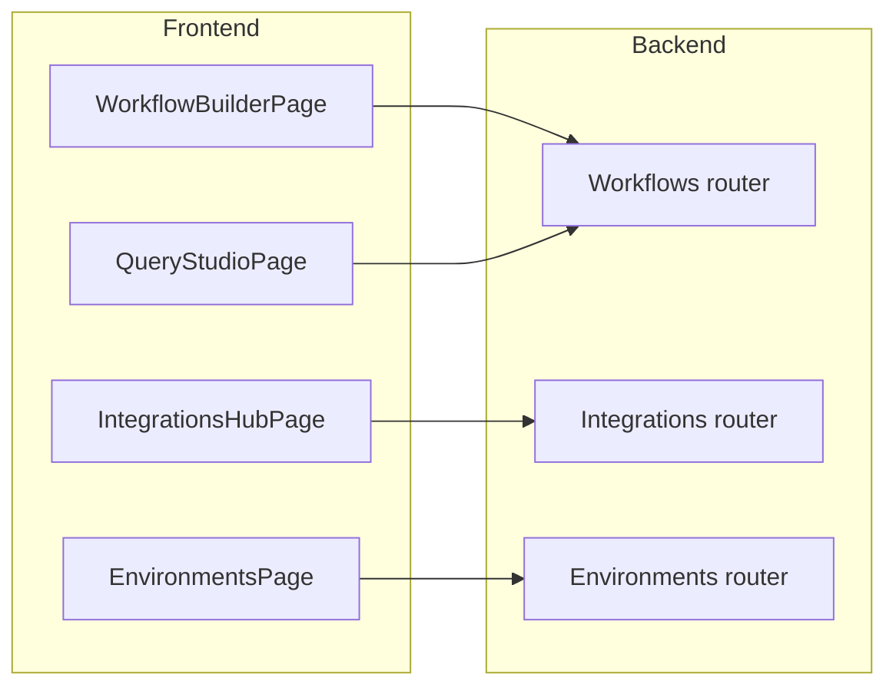

# Persisted Workflows, Integrations Management, and Advanced Query Studio

## Scope

Enhance the existing RAG Studio scaffold by:

- **Persisting workflows** defined in the Workflow Builder canvas into the FastAPI backend models and database-ready structures.
- **Adding full CRUD flows for integrations and environments** in the Integrations Hub (and related Admin surfaces), wired to backend routers.
- **Deepening Query Studio** with multi-strategy comparison, richer retrieval trace visualization, and tighter alignment to RAG patterns.
- **Improving UX polish and explainability** across these modules while respecting existing styles and patterns.

---

## Architecture Overview

- **Frontend (`frontend/`)**
  - React + TypeScript with React Router and React Query.
  - Feature modules: `workflow-builder`, `query-studio`, `admin-integrations`, `admin-environments`.
  - Shared `api` layer wrapping FastAPI endpoints.
- **Backend (`backend/`)**
  - FastAPI routers for `workflows`, `integrations`, `environments`, `governance`.
  - Initially in-memory storage, but models and endpoints designed to be DB-ready.
  - `simulate` workflow endpoint as the starting point for Query Studio.

---

## Part 1: Persist Workflows From Canvas to Backend Models

### 1.1. Align canvas model with backend `WorkflowDefinition`

- **Goal**: Ensure the React Flow graph can be faithfully serialized into the backend’s `WorkflowDefinition`, `WorkflowNode`, and `WorkflowEdge`.
- **Steps**:
  - Define explicit mapping utilities in a new file (e.g. `[frontend/src/modules/workflow-builder/modelMapping.ts](frontend/src/modules/workflow-builder/modelMapping.ts)`):
    - `reactFlowToWorkflowDefinition(nodes, edges, meta)` → `WorkflowDefinition`.
    - `workflowDefinitionToReactFlow(definition)` → `{ nodes, edges }` for initial canvas state.
  - Include workflow-level metadata in `meta`: `id`, `project_id`, `name`, `description`, `version`, `architecture_type`, `is_active`.
  - Store React Flow node `position` in `WorkflowNode.position` and labels in `WorkflowNode.name`.

### 1.2. Backend: extend workflows router for CRUD

- **Goal**: Support creating, reading, updating, and listing workflows.
- **Steps in `backend/routers/workflows.py`**:
  - Add endpoints:
    - `GET /api/workflows/{workflow_id}` – fetch a single workflow.
    - `PUT /api/workflows/{workflow_id}` – update an existing workflow.
    - Optionally `DELETE /api/workflows/{workflow_id}` – soft-delete or archive.
  - For now, maintain an **in-memory store** (e.g. module-level `DICT[id] -> WorkflowDefinition`) to avoid DB configuration, but ensure function boundaries are DB-ready.
  - Introduce a simple `WorkflowRepository` abstraction (even if in the same file) to keep logic out of routers.

### 1.3. Frontend: workflow API hooks

- **Goal**: Provide strongly-typed hooks for workflows.
- **Steps in `frontend/src/api/workflows.ts`**:
  - Add:
    - `getWorkflow(id)` → `GET /api/workflows/{id}`.
    - `createWorkflow(definition)` → `POST /api/workflows/`.
    - `updateWorkflow(id, definition)` → `PUT /api/workflows/{id}`.
  - In `workflow-builder` module, create React Query hooks:
    - `useWorkflow(id)` – fetch & cache workflow.
    - `useSaveWorkflow()` – mutation that decides between create/update based on presence of `id`.

### 1.4. Workflow Builder UI: saving drafts and publishing

- **Goal**: Wire Save Draft/Publish buttons to backend and display `is_active`/version info.
- **Steps in `WorkflowBuilderPage`**:
  - Add local state or context for workflow metadata (name, description, version, architecture_type, is_active).
  - Use `useWorkflow` to load existing workflow (if navigated with `:workflowId`) and feed into `workflowDefinitionToReactFlow`.
  - On Save Draft:
    - Collect nodes/edges from React Flow.
    - Map to `WorkflowDefinition` with `is_active = false` and `version` increment logic (or allow user to edit version string).
    - Call `useSaveWorkflow().mutate()`.
    - Show success/error toasts.
  - On Publish:
    - Reuse Save logic but set `is_active = true`.
    - Optionally call a dedicated `publish` endpoint later for approvals; for now just an update.
  - Display a status badge in the header (Draft vs Active) and the current version.

### 1.5. Workflow templates & RAG patterns

- **Goal**: Seed new workflows with pattern-specific topologies.
- **Steps**:
  - Create a `workflowTemplates` module in `workflow-builder` that defines common `WorkflowDefinition` skeletons for:
    - Vector RAG, Vectorless, Graph, Temporal, Hybrid.
  - Provide a way to start the builder with a template (e.g., via `state`/query param from a RAG Templates page):
    - If `template=vector`, load the vector template definition and convert to React Flow nodes/edges.
  - Ensure template nodes include minimal config stubs that match backend `config` expectations (e.g., `type: 'vector_retriever', config: { index_ref: '', top_k: 10 }`).

---

## Part 2: Integrations & Environments Creation/Edit Flows

### 2.1. Backend: extend routers for update/delete

- **Goal**: Make `integrations` and `environments` fully mutable via the API.
- **Steps in `backend/routers/integrations.py`**:
  - Add module-level `INTEGRATIONS: Dict[str, IntegrationConfig] = {}` store.
  - Implement:
    - `GET /api/integrations/{id}` – fetch.
    - `PUT /api/integrations/{id}` – update.
    - `DELETE /api/integrations/{id}` – delete/soft-delete.
  - Mirror in `backend/routers/environments.py` with `ENVIRONMENTS: Dict[str, EnvironmentConfig]` and similar CRUD endpoints.

### 2.2. Frontend API layer

- **Goal**: Wrap new endpoints for use in the Integrations Hub.
- **Steps in `frontend/src/api/integrations.ts` and `environments.ts`**:
  - Add:
    - `getIntegration(id)`, `createIntegration`, `updateIntegration`, `deleteIntegration`.
    - `getEnvironment(id)`, `createEnvironment`, `updateEnvironment`, `deleteEnvironment`.
  - Provide React Query hooks in `admin-integrations` module:
    - `useIntegrations`, `useCreateIntegration`, `useUpdateIntegration`, `useDeleteIntegration`.
    - `useEnvironments`, `useCreateEnvironment`, `useUpdateEnvironment`, `useDeleteEnvironment`.

### 2.3. Integrations Hub UI: creation & edit wizard

- **Goal**: Deliver a wizard-driven, reusable integrations experience.
- **Steps in `IntegrationsHubPage` and new components**:
  - Introduce an `IntegrationWizard` component (modal or side panel) with 3 steps:
    1. **Basics**: name, provider type (category), description.
    2. **Connection**: `credentials_reference` (string), environment mapping (key/value pairs for dev/test/staging/prod).
    3. **Policies**: `default_usage_policies` (e.g., max_qps, allowed_projects).
  - Support both **create** and **edit** modes, pre-filling values when editing.
  - On save, call the appropriate mutation and refetch integrations.
  - Add basic validation (required fields, at least one environment mapping, etc.).

### 2.4. Environment management UI

- **Goal**: Surface environment definitions and integration bindings in a matrix-like view.
- **Steps**:
  - Add an `EnvironmentsPage` under Admin or as a section in Integrations Hub.
  - Display a list of environments with ability to create/edit/delete via a simple form.
  - For each environment, show `integration_bindings` as a list of mappings:
    - Logical integration ID → concrete integration config ID.
  - Provide UI controls (autocomplete/dropdown) to select an integration for each logical binding.
  - Use `updateEnvironment` to persist binding changes.

### 2.5. UX polish and consistency

- **Goal**: Maintain consistent design and avoid duplication.
- **Steps**:
  - Reuse button styles and card patterns from existing layout CSS.
  - Use consistent table styling and spacing for lists of integrations and environments.
  - Ensure pages are responsive and align with the control-plane aesthetic.

---

## Part 3: Advanced Query Studio (Multi-Strategy & Rich Traces)

### 3.1. Extend simulate payload and response for strategies

- **Goal**: Allow Query Studio to run and compare multiple retrieval strategies per query.
- **Backend steps in `workflows.py`**:
  - Extend `WorkflowSimulationRequest`:
    - Add optional `strategies: List[str]` and `parameters: Dict[str, Any]` (e.g., top_k overrides, filters).
  - Extend `WorkflowSimulationTrace` or introduce a `MultiStrategySimulationTrace`:
    - Structure: `results: List[{ strategy_id, trace: WorkflowSimulationTrace }]`.
  - Add an endpoint:
    - `POST /api/workflows/{workflow_id}/simulate-multi` returning multi-strategy traces (initially stubbed with variations on the base stub).

### 3.2. Query Studio UI: comparison mode

- **Goal**: Side-by-side visualization of different strategies or workflow versions.
- **Steps in `QueryStudioPage`**:
  - Add controls for selecting multiple **workflow IDs or strategy labels** (e.g., Vector, Vectorless, Hybrid).
  - Use a new React Query mutation to call `simulate-multi` and receive multiple traces.
  - Render a **two or three-column layout**, each showing:
    - Strategy name.
    - Answer, latency, confidence, hallucination risk.
    - High-level retrieval summary (e.g., number of vector hits, graph steps).

### 3.3. Rich trace visualization

- **Goal**: Make retrieval explainable and visual.
- **Steps**:
  - Break down the trace view into tabs or accordions:
    - **Timeline**: ordered list of steps (input → classification → retrievals → rerank → LLM) with simple icons.
    - **Sources**: table of retrieved sources with similarity/score, metadata, and type (vector/lexical/graph).
    - **Graph traversal**: if any graph steps, show a small graph-style depiction (static list for now, later integrate a mini React Flow or SVG).
    - **Temporal filters**: show applied time ranges, snapshot/valid-from/to details.
  - Use collapsible panels to avoid clutter while still exposing details.

### 3.4. Parameter manipulation and reruns

- **Goal**: Let users tweak key retrieval parameters without editing workflows directly.
- **Steps**:
  - Provide parameter controls above the trace:
    - Top-k, similarity metric, temporal window, inclusion/exclusion of graph retrieval.
  - Pass these into the `parameters` field of `WorkflowSimulationRequest`.
  - Show which parameters were used in each run, so results are explainable.

### 3.5. Future hooks for evaluation

- **Goal**: Prepare Query Studio to feed into Evaluations.
- **Steps**:
  - Add a “Save as test case” action that packages query + workflow/strategy + actual answer into a structure compatible with a future evaluation set model.
  - This can be stored with a placeholder endpoint for later implementation.

---

## Part 4: UX Enrichment & Cross-Cutting Improvements

### 4.1. Status indicators and empty states

- Add non-intrusive banners or badges:
  - For workflows: `Draft`, `Active`, `Deprecated`.
  - For integrations/environments: `Healthy`, `Unknown`, `Degraded` (stubbed until real health checks exist).
- Design thoughtful empty states:
  - Workflow Builder: “No workflow yet – create from template or start from scratch.”
  - Integrations Hub: “No integrations – connect your first provider.”
  - Query Studio: “Run your first query to see traces and answers.”

### 4.2. Loading and error handling

- Standardize loading spinners and error messages via small shared components in a `ui` module.
- Ensure all API-backed pages show clear progress and retry options (especially Query Studio and Integrations Hub).

### 4.3. Keyboard and accessibility basics

- Ensure key buttons are reachable via tab, with visible focus outlines.
- Add `aria-label`s for important controls in the workflow canvas and Query Studio panels.

---

## Implementation Todos

- `wf-persist-model-mapping`: Implement mapping utilities between React Flow structures and `WorkflowDefinition` models.
- `wf-backend-crud`: Add full CRUD endpoints and an in-memory repository for workflows in the backend.
- `wf-frontend-crud-hooks`: Implement workflow API methods and React Query hooks on the frontend.
- `wf-ui-save-publish`: Wire Save Draft/Publish buttons to backend and surface version / `is_active` badges.
- `wf-templates-rag-patterns`: Add workflow templates for Vector, Vectorless, Graph, Temporal, and Hybrid RAG and integrate them into the builder.
- `int-env-backend-crud`: Add CRUD repositories and endpoints for integrations and environments.
- `int-env-frontend-crud-hooks`: Implement frontend CRUD functions and hooks for integrations and environments.
- `int-ui-wizard`: Build an IntegrationWizard component for creation/editing with steps for basics, connection, and policies.
- `env-ui-matrix`: Implement an environment management page with integration bindings matrix-style UI.
- `qs-backend-multi-sim`: Extend workflow simulation models and add a `simulate-multi` endpoint that returns multi-strategy traces (stubbed initially).
- `qs-ui-comparison`: Implement multi-strategy comparison layout in Query Studio using the multi-simulate endpoint.
- `qs-ui-rich-traces`: Build richer trace visualization (timeline, sources table, graph/temporal panels) and tie to simulation response.
- `qs-ui-params`: Add parameter controls for top-k, temporal window, etc., and pass them into simulation requests.
- `ux-empty-loading`: Standardize empty states, loading indicators, and error handling across Workflow Builder, Query Studio, and Admin.
- `ux-a11y-basics`: Add basic accessibility improvements (focus states, aria labels) to new components.

