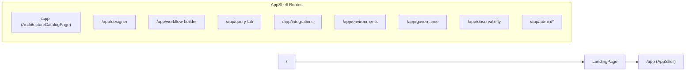

# RAG Studio Control Plane Transformation Plan

## 1. Current Codebase Preservation Plan

### 1.1 Modules to Preserve and Evolve

- **Frontend shell & routing**
  - Preserve `AppShell` layout and core routing in `[frontend/src/App.tsx](frontend/src/App.tsx)` and `AppShell` module; evolve nav labels/structure to new IA.
  - Keep `LandingPage` auth/marketing entry in `modules/auth/LandingPage.tsx`, updating copy to reflect architecture catalog orientation when needed.
- **Workflow Builder module**
  - Preserve `WorkflowBuilderPage`, `WorkflowCanvas`, `NodePalette`, and `modelMapping` in `modules/workflow-builder/`**.
  - Evolve to:
    - Support architecture-aware starter graphs from templates (already typed in `workflowTemplates.ts`).
    - Add real `NodeConfigPanel` with per-node config forms and validation.
    - Surface architecture badge, workflow meta (name, version, status) in header.
    - Handle design-session context from the new Guided Designer.
- **Query Studio module**
  - Preserve `QueryStudioPage` and `TracePanels` in `modules/query-studio/`**.
  - Evolve from a generic multi-strategy stub into a **Query Lab / Evaluation Studio** with:
    - Architecture/workflow selection.
    - Saved test cases and run history filters.
    - Side-by-side comparison views over the existing `simulate-multi` endpoint.
- **Integrations & Environments**
  - Preserve `IntegrationsHubPage`, `IntegrationWizard`, and `useIntegrationsEnvApi` in `modules/admin-integrations/`**.
  - Evolve UI into **Integrations Studio**:
    - Stronger categorization (LLM, embedding, reranker, vector DB, graph DB, SQL, document repo, storage, observability, identity, policy engine, messaging).
    - More detailed integration detail view with dependency graph and usage scope info.
  - Preserve environments matrix; evolve into a dedicated **Environments & Deployment** surface with binding matrix, readiness checklist, and promotion intent.
- **Admin modules**
  - Preserve admin pages in `modules/admin-*/`** and shared auth `AuthContext`/permissions utilities.
  - Evolve to:
    - Surface real RBAC permissions aligned to platform concepts.
    - Expand Observability page into a multi-tab view over workflow runs and audit logs.
- **Backend core**
  - Preserve FastAPI app structure in `[backend/main.py](backend/main.py)` and router/modules layout under `[backend/routers](backend/routers)`.
  - Keep SQLModel-backed models in `[backend/models_core.py](backend/models_core.py)` and `[backend/models_admin.py](backend/models_admin.py)` as the foundation for persistence.
  - Preserve `ProjectRepository`, `IntegrationRepository`, `EnvironmentRepository` in `[backend/repositories.py](backend/repositories.py)`, extending with new repos for architectures, design sessions, governance, and evaluations.
  - Preserve current workflow simulation endpoints in `[backend/routers/workflows.py](backend/routers/workflows.py)` as the initial simulation path; evolve payloads and responses while clearly marking simulated behavior.

### 1.2 Modules to Refactor

- **Workflow definitions and persistence**
  - Replace the in-memory `_WORKFLOWS` dict in `[backend/routers/workflows.py](backend/routers/workflows.py)` with a proper SQLModel `WorkflowDefinitionRecord` table (new) and a `WorkflowRepository` abstraction.
  - Keep the Pydantic `WorkflowDefinition` schema as the API contract, mapping to the persisted record.
- **Admin in-memory stores**
  - Migrate in-memory stores in:
    - `admin_sessions.py` (sessions),
    - `admin_views.py` (views),
    - `admin_preferences.py` (preferences),
    - `admin_observability.py` (audit logs/events),
    into SQLModel-backed tables already defined in `models_admin.py`.
  - Introduce repositories for these entities to remove ad-hoc module-level dicts.
- **Governance router**
  - Replace the stubbed, always-empty responses in `[backend/routers/governance.py](backend/routers/governance.py)` with a real governance model (policy sets, approval rules) and basic CRUD.
- **Auth flow consistency**
  - Refactor `auth.py` to:
    - Optionally link Google identity (`sub`, email) to a persisted `User` row.
    - Generate backend JWTs that encode `user_id` and role/permissions snapshot.
  - Update frontend `AuthContext` to support both the Google token and backend-issued token, with a clearly-documented simulation mode when backend auth is relaxed.

### 1.3 Modules to Replace or Strongly Rework

- **DashboardPage**
  - Replace the placeholder dashboard with an **Architecture Catalog / Home** experience that:
    - Shows the six architecture tiles.
    - Surfaces recent design sessions, workflows, and runs.
    - Gives entry into Guided Designer and Query Lab.
- **Query Studio UX shell**
  - Keep data hooks, but replace the current plain form layout with a structured Query Lab including:
    - Query input panel.
    - Architecture/workflow selector dropdowns.
    - Strategy and environment selectors.
    - Results comparison grid and a detailed run panel.
- **Observability UI**
  - Replace the minimal metrics + table in `AdminObservabilityPage` with a multi-tab Observability & Trace Analytics module:
    - Runs list, run detail, node timeline, audit events.

### 1.4 New Modules/Routes Needed

- **Frontend**
  - `modules/architecture-catalog/ArchitectureCatalogPage.tsx` (Home / Catalog).
  - `modules/guided-designer/DesignerPage.tsx` with stepper-based wizard subcomponents per architecture type.
  - `modules/workflow-builder/ArchitectureSummaryPanel.tsx` (builder header side panel).
  - `modules/integrations-studio/` (split from admin-integrations or composed on top of it for richer views).
  - `modules/environments/EnvironmentsPage.tsx` (promotion, bindings, readiness).
  - `modules/governance/GovernancePage.tsx`.
  - `modules/observability/ObservabilityPage.tsx` (expanded from admin observability; may coexist or wrap).
  - `modules/admin-rbac/` helpers for roles/permissions visualization.
- **Backend**
  - New or extended routers for:
    - `architectures` (architecture templates/types, design sessions).
    - `governance` (policies/approvals richer model).
    - `evaluations` (query cases, comparisons, evaluation runs).
    - Additional observability endpoints (workflow run detail, task list, filters).
  - New models:
    - ArchitectureTemplate, ArchitectureInstance/DesignSession, WorkflowDefinitionRecord, GovernancePolicy, ApprovalRule, EvaluationRun, QueryCase, DeploymentTarget/RuntimeProfile, EnvironmentBinding (if separate from Environment).

---

## 2. Proposed Revised App Structure

### 2.1 Frontend App Structure & Navigation

#### Top-Level Navigation (inside `AppShell`)

- **Home / Catalog** → `ArchitectureCatalogPage`
- **Designer** → `DesignerPage` (Guided Designer multi-step wizard)
- **Workflow Builder** → `WorkflowBuilderPage` (architecture-aware orchestration)
- **Query Lab** → `QueryLabPage` (evolved from `QueryStudioPage`)
- **Integrations** → `IntegrationsStudioPage` (wraps existing Integrations Hub)
- **Environments** → `EnvironmentsPage`
- **Governance** → `GovernancePage`
- **Observability** → `ObservabilityPage` (may reuse admin observability endpoints initially)
- **Admin** → `AdminUsersPage` with nested tabs (Users, Roles, Teams, Views, Preferences, Sessions, Observability)

#### Revised Route Map (conceptual)

- Update `[frontend/src/App.tsx](frontend/src/App.tsx)` to:
  - Point `/app` index to `ArchitectureCatalogPage` instead of the minimal dashboard.
  - Add new routes for designer, query lab, environments, governance, and observability.
  - Keep `/app/admin/...` routes but link them under a single **Admin** nav group.

### 2.2 Frontend Module Layout (by feature)

- `[frontend/src/modules/architecture-catalog/]`
  - `ArchitectureCatalogPage.tsx`
  - `ArchitectureTile.tsx` (reusable card component).
- `[frontend/src/modules/guided-designer/]`
  - `DesignerPage.tsx` (router entry; consumes selected architecture from URL or context).
  - `DesignerStepper.tsx` (progress indicator wrapper).
  - `steps/VectorDesignerStepGroups.tsx` (grouped sections per vector RAG requirements).
  - `steps/VectorlessDesignerStepGroups.tsx`
  - `steps/GraphDesignerStepGroups.tsx`
  - `steps/TemporalDesignerStepGroups.tsx`
  - `steps/HybridDesignerStepGroups.tsx`
  - `steps/CustomDesignerStepGroups.tsx`.
  - Shared types in `designerTypes.ts` (per-architecture configuration interfaces).
- `[frontend/src/modules/workflow-builder/]` (extend existing)
  - Add `NodeConfigPanel.tsx` (per-node configuration forms driven by node type).
  - Add `ArchitectureSummaryPanel.tsx` (architecture badge, high-level config, link back to designer session).
  - Extend `workflowTemplates.ts` to include non-empty starter graphs per architecture.
- `[frontend/src/modules/query-lab/]`
  - Refactor `QueryStudioPage.tsx` into `QueryLabPage.tsx` with subcomponents:
    - `QueryInputPanel.tsx`
    - `StrategySelector.tsx`
    - `RunHistoryPanel.tsx`
    - `ResultComparisonGrid.tsx`
    - `RunDetailDrawer.tsx`.
- `[frontend/src/modules/integrations-studio/]`
  - Wrap `IntegrationsHubPage` with additional views:
    - `IntegrationsStudioPage.tsx` (tabs for List, Matrix, Dependencies).
    - Reuse `IntegrationWizard` and `useIntegrationsEnvApi`.
- `[frontend/src/modules/environments/]`
  - `EnvironmentsPage.tsx` (list + detail + binding matrix).
  - `EnvironmentDetailPanel.tsx` (runtime profile, policy profile, readiness checklist).
- `[frontend/src/modules/governance/]`
  - `GovernancePage.tsx` (policy sets, approvals, status badges).
- `[frontend/src/modules/observability/]`
  - `ObservabilityPage.tsx` (runs list, run detail, task timeline, audit events).
- `[frontend/src/modules/admin-*]`
  - Keep existing modules but:
    - Introduce a shared `AdminShell` component for nested Admin navigation.
    - Add a `Sessions` tab reusing `/api/admin/sessions`.
- `[frontend/src/api/]`
  - Add `architectures.ts`, `designerSessions.ts`, `governance.ts`, `evaluations.ts`, and extend `workflows.ts`, `environments.ts` with new methods.

### 2.3 Backend Structure

- **New models file**: `[backend/models_architecture.py]`
  - `ArchitectureType` (enum-ish str type): vector, vectorless, graph, temporal, hybrid, custom.
  - `ArchitectureTemplate` (SQLModel table for catalog items + default config skeletons).
  - `DesignSession` (SQLModel table to store per-architecture design wizard state).
  - `WorkflowDefinitionRecord` (SQLModel table wrapping `id`, `project_id`, `architecture_type`, `definition_json`, `status`, `version`, `created_at`, `updated_at`).
- **New models file**: `[backend/models_governance.py]`
  - `GovernancePolicy`, `ApprovalRule`, `GovernanceBinding` (linking policies to architectures/workflows/environments).
- **New models file**: `[backend/models_evaluation.py]`
  - `QueryCase`, `EvaluationRun`, `QueryComparison`.
- **New router**: `[backend/routers/architectures.py]`
  - `GET /api/architectures/catalog` (list architecture templates and metadata for the catalog tiles).
  - `POST /api/architectures/design-sessions` (create session with selected type and initial defaults).
  - `GET /api/architectures/design-sessions/{id}` / `PATCH` (load/save wizard state and computed architecture definition object).
- **Extend workflows router**
  - Use `WorkflowDefinitionRecord` for persistence.
  - Add `GET /api/workflows/by-architecture/{type}` and `GET /api/workflows/{id}/summary` for builder and catalog summary views.
- **Extend governance router**
  - CRUD for policy sets and approvals, plus associations to workflows/environments.
- **Extend observability**
  - Add endpoints to fetch workflow runs and task executions in a way optimized for the Observability UI (e.g., `GET /api/observability/runs`, `/runs/{id}`, `/runs/{id}/tasks`).

---

## 3. Data Model Revision Plan

### 3.1 Architecture & Design

- **ArchitectureType / ArchitectureTemplate**
  - Define a canonical `ArchitectureType` enum (string-based) shared across backend and frontend.
  - `ArchitectureTemplate` fields:
    - `id` (PK), `type` (ArchitectureType), `title`, `short_definition`, `when_to_use`, `strengths` (list/JSON), `tradeoffs` (list/JSON), `typical_backends` (list/JSON), `default_workflow_template_id` (FK or string key), `default_config_schema` (JSON for wizard hints).
  - Use this to power catalog tiles and to derive defaults for design sessions.
- **DesignSession**
  - Fields:
    - `id` (PK), `project_id` (nullable), `architecture_type`, `status` (`draft`, `in_progress`, `completed`), `wizard_state` (JSON capturing step data), `derived_architecture_definition` (JSON), `created_at`, `updated_at`.
  - Backend: router for CRUD; frontend: Designer uses it as the backing store.

### 3.2 Workflows & Orchestration

- **WorkflowDefinitionRecord** (DB persistence of `WorkflowDefinition`)
  - Fields:
    - `id` (string or PK + external key), `project_id`, `design_session_id` (nullable FK), `architecture_type`, `name`, `description`, `version`, `status` (`draft`, `active`, `deprecated`), `definition` (JSON of nodes/edges/meta), `created_at`, `updated_at`.
  - Map to/from the existing Pydantic `WorkflowDefinition` type using serializer utilities.
- **Node metadata**
  - Extend `WorkflowNode`’s `config` to be more structured per type in docs and frontend types, but keep backend flexible (JSON field) for now.
  - Add optional `category` or `group` to nodes in frontend to drive palette grouping.

### 3.3 Integrations & Environment Binding

- **Integrations**
  - Keep existing `Integration` model; enrich `default_usage_policies` and `environment_mapping` semantics with clearer keys:
    - `environment_mapping` keyed by environment external ID.
    - Add `tags` list (JSON) and `usage_scope` (e.g., `project_ids`, `architecture_types`).
  - Add `IntegrationDependency` model (new) to capture relationships:
    - `id`, `parent_integration_id`, `child_integration_id`, `relationship_type` (e.g., `uses_secret`, `routes_to`, `depends_on`).
- **Environments / EnvironmentBinding**
  - Keep `Environment` but clarify semantics:
    - `external_id`, `name`, `description`, `runtime_profile` (JSON), `policy_profile_id` (FK to GovernancePolicy), `promotion_status`, `approval_state`, `health_status`.
  - Consider a separate `EnvironmentBinding` table if `integration_bindings` becomes complex (architecture-specific bindings); initially can remain a JSON map with well-documented structure.

### 3.4 Governance & Guardrails

- **GovernancePolicy**
  - Fields:
    - `id`, `name`, `scope` (`architecture`, `workflow`, `environment`), `rules` (JSON), `created_by`, `created_at`, `updated_at`.
- **ApprovalRule**
  - Fields:
    - `id`, `name`, `applies_to` (`publish_workflow`, `promote_environment`, etc.), `required_roles`, `escalation_path` (JSON), `active`.
- **GovernanceBinding**
  - Links governance artifacts:
    - `id`, `policy_id`, `workflow_id` (nullable), `environment_id` (nullable), `architecture_type` (nullable), `status`.

### 3.5 Observability & Evaluation

- **WorkflowRun / TaskExecution (extend existing)**
  - Add fields to `WorkflowRun`:
    - `architecture_type`, `strategy_id` (for Query Lab runs), `environment_external_id`, `is_simulated` (bool), `metrics` (JSON: latency, tokens, cost estimate).
  - Add fields to `TaskExecution`:
    - `architecture_type`, `step_index`, `trace_metadata` (JSON with e.g. retrieval type, rerank scores).
- **Evaluation models**
  - `QueryCase`: `id`, `project_id`, `architecture_type`, `input_text`, `expected_answer` (optional), `labels` (JSON tags).
  - `EvaluationRun`: `id`, `query_case_id`, `workflow_id`, `strategy_id`, `metrics` (JSON), `created_at`.

### 3.6 Admin, Auth, RBAC

- **User / Role / Team**
  - Keep `User`, `Role`, `Team` in `models_admin.py`; ensure `Role.permissions` includes keys aligned with platform capabilities:
    - `design_architecture`, `manage_integrations`, `manage_environments`, `run_evaluations`, `publish_workflows`, `approve_promotions`, `view_observability`, `administer_platform`.
- **Session**
  - Shift session handling to DB-backed `Session` with status and timestamps.
  - Link `Auth` router’s successful sign-ins to `Session` rows.
- **View / UserPreference**
  - Ensure `View` encodes core module names and `UserPreference` includes `default_view_id`, `theme`, `density`, `time_zone`.

---

## 4. Implementation Phase Plan

### Phase 1: Deep Inspection & Foundations (you are here)

- **4.1. Confirm preservation vs refactor decisions**
  - Lock in the modules to keep and evolve (shell, builder, query studio, integrations, admin, core models).
- **4.2. Introduce architecture & design models (non-breaking)**
  - Add `ArchitectureType`, `ArchitectureTemplate`, and `DesignSession` models and routers in backend, initially returning seeded in-memory or DB-backed templates.
  - Add frontend `ArchitectureCatalogPage` consuming `/api/architectures/catalog`.

### Phase 2: Information Architecture & Designer + Persistence

- **4.3. Restructure navigation**
  - Update `AppShell` nav to the new modules (Catalog, Designer, Workflow, Query Lab, Integrations, Environments, Governance, Observability, Admin).
  - Change `/app` index route to `ArchitectureCatalogPage`.
- **4.4. Implement Architecture Catalog**
  - Build `ArchitectureCatalogPage` with six tiles, each populated from `ArchitectureTemplate` data:
    - Title, concise definition, when to use, strengths, tradeoffs, typical backends, CTA button.
  - When a tile is selected:
    - Call `POST /api/architectures/design-sessions` with `architecture_type` and optional `project_id`.
    - Route to `/app/designer/:sessionId`.
- **4.5. Implement Guided Designer (type-specific wizard)**
  - Build `DesignerPage` with a stepper and per-type step groups using strongly-typed configuration interfaces.
  - Persist wizard state to the `DesignSession` record on every step/save via `PATCH`.
  - On completion, generate an internal `architecture_definition` (JSON) that:
    - Encodes high-level decisions.
    - Suggests an initial workflow template key.
  - Provide CTA: “Generate workflow graph” → POST to `/api/workflows/from-design-session` to create a `WorkflowDefinitionRecord` based on selected architecture.
- **4.6. Improve workflow persistence**
  - Introduce `WorkflowDefinitionRecord` SQLModel with JSON `definition` and link to `DesignSession`.
  - Refactor workflows router to read/write from DB via `WorkflowRepository` while keeping API shapes compatible for the frontend.
  - Update frontend `useWorkflows`/`useSaveWorkflow` hooks to use the new persistence; ensure existing builder flow still works.

### Phase 3: Upgrade Workflow Builder, Integrations, Environments, Query Lab

- **4.7. Architecture-aware Workflow Builder**
  - Populate `workflowTemplates.ts` with real starter graphs per architecture type.
  - On opening a workflow that has `design_session_id`, display architecture summary (badge + canonical description) and link back to Designer.
  - Implement `NodeConfigPanel` with node-type-specific forms and validation; store configuration in node `data.config` and persist through mapping.
  - Support basic validation and warning banners when required nodes/paths are missing (e.g., no retrieval node, no answer generator).
- **4.8. Integrations Studio**
  - Wrap `IntegrationsHubPage` into `IntegrationsStudioPage` with:
    - Category filters and badges per integration.
    - Integration detail side panel summarizing credentials reference, environments, policies, dependencies.
    - A (stubbed) “Test connection” action, clearly labeled as simulated when no real backend call exists.
  - Extend backend `Integration` model with tags and usage scope fields.
- **4.9. Environments & Deployment**
  - Create `EnvironmentsPage` using existing `/api/environments` endpoints, enhanced with:
    - Runtime profile summary (JSON displayed as key-value cards).
    - Policy profile reference and promotion status fields.
    - Readiness checklist (purely UI-level initially) derived from presence of bound integrations and governance approvals.
  - Add endpoints/fields for promotion status and approval state in `Environment`.
- **4.10. Query Lab / Evaluation Studio**
  - Refine `QueryStudioPage` into `QueryLabPage`:
    - Workflow/architecture selectors driven by `/api/workflows` and `/api/architectures/catalog`.
    - Strategy selection based on architecture type.
    - Parameter controls (top-k, temporal window, etc.) sent to `simulate-multi`.
  - Enrich result UI:
    - Comparison cards with metrics (latency, confidence, hallucination risk, tokens, cost estimate, clearly marked as simulated where applicable).
    - Detailed trace tabs reusing and extending `TracePanels`.
  - Add “Save as test case” action posting to an `evaluations` router with placeholder persistence.

### Phase 4: Governance, Observability, Admin, Auth Consistency

- **4.11. Governance & Guardrails module**
  - Implement `GovernancePolicy`, `ApprovalRule`, and `GovernanceBinding` models and a `governance` router with simple CRUD.
  - Build `GovernancePage` to:
    - Show policy sets and where they apply (architectures, workflows, environments).
    - Display approval gateways for publish and promotion actions.
  - Integrate governance state into:
    - Workflow publish flow (show if approval is required/pending/approved).
    - Environment promotion UI (Environments page).
- **4.12. Observability & Trace Analytics**
  - Extend `WorkflowRun` and `TaskExecution` models with richer metadata and simulated metrics.
  - Update simulation endpoints to populate these fields while keeping behavior clearly flagged as simulated.
  - Build `ObservabilityPage` that:
    - Lists runs with filters (architecture, environment, status, simulated vs real).
    - Surfaces run-level metrics and node-level timelines.
    - Integrates admin audit logs for governance actions.
- **4.13. Admin & RBAC refinement**
  - Migrate remaining in-memory admin stores (views, preferences, sessions, observability events) to DB-backed repositories.
  - Align `Role.permissions` with the new permission keys and expose them in a structured way to the frontend.
  - Wire frontend `Can`/`useHasPermission` into navigation and page-level controls so governance and visibility reflect RBAC.
  - Add backend dependencies to enforce key permissions on sensitive routes (publish, approval, management actions), while documenting any remaining stubbed enforcement with TODOs.
- **4.14. Auth & security cleanup**
  - Clarify and document auth flow:
    - Google sign-in → backend token (simulated or real), linking to `User` and `Session`.
    - Frontend stores backend token (e.g., in memory + `localStorage`) and attaches it to `apiClient` requests.
  - Add explicit comments and README guidance where production-hardening is required (token expiry, refresh, secret management).

### Phase 5: UX Polish, Sample Data, and Documentation

- **4.15. UX & Visual Quality**
  - Introduce reusable UI primitives in `modules/ui` for:
    - Tiles/cards, status badges, stepper, tables, panels, drawers.
  - Apply consistent dark control-plane aesthetic across new modules, reusing existing CSS where possible.
  - Improve empty states, helper texts, and inline explanations (especially in Designer and Query Lab) while clearly labeling simulated behavior.
- **4.16. Sample Data / Demo Readiness**
  - Seed demo data via backend startup or dedicated `/api/demo/seed` endpoint:
    - Architecture templates for each RAG type.
    - Example design sessions and workflows per architecture.
    - Example integrations (OpenAI, Anthropic, pgvector, Elastic, Neo4j, S3, etc. — referencing credential keys, not secrets).
    - Example environments (dev, test, staging, prod) with binding matrices.
    - Example query runs and observability records.
    - Example governance policies and admin users/roles/teams.
- **4.17. Documentation**
  - Update root `README.md` with:
    - High-level product overview emphasizing architecture selection, design, configuration, evaluation, governance, and deployment readiness.
    - Architecture diagram of frontend + backend modules and main flows.
    - Sections on what is simulated vs real and how to extend to real providers.
  - Add module-level docs under a `docs/` or `.cursor/plans/`-adjacent structure:
    - Product architecture and module overview.
    - Data model overview (architectures, design sessions, workflows, integrations, environments, governance, evaluations, admin).
    - Flow: Architecture selection → Guided Designer → Workflow generation → Query Lab → Governance/Observability → Environments/Deployment.

---

## Todos (High-Level Implementation Checklist)

- **ia-shell-update**: Update `AppShell` navigation and routes to match the new top-level modules (Catalog, Designer, Workflow Builder, Query Lab, Integrations, Environments, Governance, Observability, Admin).
- **arch-catalog**: Implement `ArchitectureCatalogPage` and backend `ArchitectureTemplate`/catalog endpoint so users can select Vector, Vectorless, Graph, Temporal, Hybrid, or Custom RAG and start a design session.
- **guided-designer**: Build the multi-step Guided Designer with per-architecture configuration schemas and persist `DesignSession` state.
- **workflow-persistence**: Introduce `WorkflowDefinitionRecord` persistence and refactor workflows router/front-end hooks to use DB-backed storage while keeping API contracts stable.
- **builder-upgrade**: Upgrade Workflow Builder with architecture-aware templates, node palette grouping, config side panel, validation, and architecture summary header.
- **integrations-environments**: Evolve Integrations Hub into Integrations Studio and create a dedicated Environments page with binding matrix, runtime profile, and deployment readiness views.
- **query-lab-evaluation**: Transform Query Studio into a richer Query Lab with strategy selection, parameter controls, run history, saved test cases, and enhanced trace visualization.
- **governance-observability**: Implement governance models and UI, extend observability for workflow runs and traces, and integrate governance statuses into publish/promotion flows.
- **admin-auth-rbac**: Migrate in-memory admin data to DB, align role permissions with platform capabilities, enforce RBAC in frontend and backend, and make auth/token handling internally consistent.
- **ux-docs-demo**: Polish UX components, seed sample data, and update documentation to clearly describe current capabilities vs simulated behavior and future roadmap.

