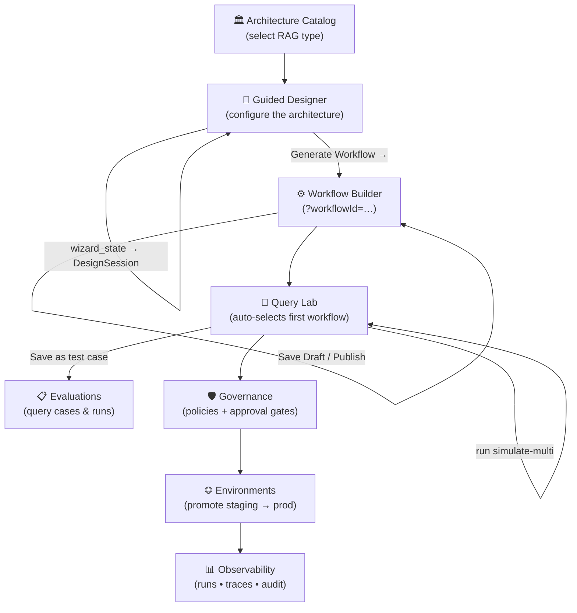

# RAG Studio — Enterprise RAG Architecture Control Plane

> A **no-code / low-code control plane** for designing, configuring, testing, and operating enterprise Retrieval-Augmented Generation systems end-to-end — from architecture selection to production observability.

---

## What Is RAG Studio?

RAG Studio treats **RAG architecture selection as a first-class engineering decision**. Instead of hand-rolling retrieval pipelines, teams use RAG Studio to:

1. **Browse** 6 canonical RAG architecture patterns
2. **Configure** the chosen architecture through a type-aware guided wizard
3. **Generate** a node-graph workflow automatically from that configuration
4. **Test** the workflow against real or simulated backends in the Query Lab
5. **Gate** publishing and promotion through configurable governance policies
6. **Operate** with live run history, node-level traces, and audit logs

---

## Modules

| Module | Route | Purpose |
|---|---|---|
| **Architecture Catalog** | `/app` | Browse 6 canonical RAG architecture types; start a design session |
| **Guided Designer** | `/app/designer?sessionId=…` | Multi-step wizard; type-specific config forms per architecture; generates a runnable workflow graph |
| **Workflow Builder** | `/app/workflow-builder?workflowId=…` | Visual node-and-edge canvas; loads workflows generated by Designer or from templates |
| **Query Lab** | `/app/query-lab` | Run test queries, compare strategies side-by-side, save test cases |
| **Integrations** | `/app/integrations` | LLM, embedding, vector DB, graph DB, storage, and identity connectors |
| **Environments** | `/app/environments` | Dev/test/staging/prod targets with binding matrix and readiness checklist |
| **Governance** | `/app/governance` | Policy sets, approval gates, workflow and environment bindings |
| **Observability** | `/app/observability` | Workflow runs, task timelines, metrics, and audit events |
| **Admin** | `/app/admin/*` | Users, Roles, Teams, Views, Preferences, Sessions |

---

## Key User Flow



### Generate Workflow — end-to-end detail

```
Guided Designer (wizard config)
    │
    │ wizardStateToWorkflowDefinition()   ← designerToWorkflow.ts
    │ Converts per-arch config values     (embedding model, top_k,
    │ to positioned nodes + edges          graph traversal depth, …)
    │
    ▼
POST /api/workflows  →  WorkflowDefinition (DB)
    │
    ▼
Workflow Builder  ?workflowId={id}
    │  useWorkflow(workflowId) fetches graph from API
    │  Node positions & configs pre-filled from wizard choices
    ▼
Save Draft / Publish  →  toast + URL update to ?workflowId={saved.id}
```

---

## Architecture Overview

```
┌─────────────────────────── Frontend (React + Vite + TypeScript) ──────────────────────┐
│                                                                                        │
│  AppShell  ── auto-seeds demo data on first session (GET /api/demo/seed-status)        │
│  ├─ ArchitectureCatalogPage   ─── POST /api/architectures/design-sessions              │
│  ├─ DesignerPage              ─── PATCH /api/architectures/design-sessions/{id}        │
│  │   └─ designerToWorkflow.ts ─── maps wizard cfg → WorkflowDefinition nodes/edges     │
│  ├─ WorkflowBuilderPage       ─── GET|POST|PATCH /api/workflows  (?workflowId=…)        │
│  ├─ QueryLabPage              ─── POST /api/workflows/{id}/simulate-multi               │
│  ├─ IntegrationsStudioPage    ─── GET|POST /api/integrations                           │
│  ├─ EnvironmentsPage          ─── GET|POST /api/environments                           │
│  ├─ GovernancePage            ─── GET|POST /api/governance/*                           │
│  ├─ ObservabilityPage         ─── GET /api/observability/runs                          │
│  └─ Admin Pages               ─── GET|POST /api/admin/*                                │
│                                                                                        │
└───────────────────────────────────┬────────────────────────────────────────────────────┘
                                    │ HTTP (JSON)
┌───────────────────────────────────▼────────────────────────────────────────────────────┐
│                          Backend (FastAPI + SQLModel + SQLite)                          │
│                                                                                         │
│  Routers: auth, projects, workflows, architectures, integrations, environments,         │
│           governance, evaluations, observability, admin_*, demo                         │
│                                                                                         │
│  models_core.py         → Project, WorkflowDefinition, Integration,                    │
│                           Environment, WorkflowRun, TaskExecution                      │
│  models_architecture.py → ArchitectureTemplate, DesignSession                          │
│  models_governance.py   → GovernancePolicy, ApprovalRule, GovernanceBinding            │
│  models_admin.py        → User, Role, Team, Session, View, UserPreference,             │
│                           AuditLog, ObservabilityEvent                                 │
└─────────────────────────────────────────────────────────────────────────────────────────┘
```

---

## Simulated vs Real Behaviour

Pages show a **⚠ Simulated** banner where behaviour is mocked. Real API calls are made everywhere — only the underlying LLM/vector/infra calls are fixtures.

| Feature | Status |
|---|---|
| Architecture Catalog tiles | ✅ Real DB-backed (seeded on startup) |
| Guided Designer persistence | ✅ Real DB via `DesignSession` |
| Generate Workflow → Workflow Builder | ✅ Real — maps config to nodes/edges, creates `WorkflowDefinition` |
| Workflow Builder save / publish | ✅ Real DB CRUD + URL update |
| Query Lab workflow auto-select | ✅ Picks first real workflow from `/api/workflows` |
| Query simulation (`simulate-multi`) | ⚠ Simulated — deterministic fixture responses |
| Integration health checks | ⚠ Simulated — `health_status` field only |
| Environment promotion | ⚠ Simulated — status field update, no live infra |
| Governance approval sign-off | ⚠ Simulated — status field, no real sign-off flow |
| Observability metrics | ⚠ Simulated — seeded fixture data |
| Auth (Google Sign-In) | ⚠ Mock in dev mode; set `GOOGLE_CLIENT_ID` for real |

---

## Local Development

### Backend

```bash
cd backend
python -m venv .venv && source .venv/bin/activate
pip install -r requirements.txt
uvicorn main:app --reload --port 8000
```

Interactive API docs: http://localhost:8000/docs

### Frontend

```bash
cd frontend
npm install
npm run dev
```

App: http://localhost:5173

### Demo data

Demo data is **seeded automatically** on the first page load via `AppShell`'s startup effect (`GET /api/demo/seed-status` → `POST /api/demo/seed` if empty). This includes roles, teams, users, integrations, environments, projects, workflows, governance policies, design sessions, and sample observability events.

To seed manually or re-seed:

```bash
# Seed (idempotent — safe to run multiple times)
curl -s -X POST http://localhost:8000/api/demo/seed | python3 -m json.tool

# Check seed status
curl -s http://localhost:8000/api/demo/seed-status | python3 -m json.tool

# Clear demo users (keeps templates and governance)
curl -s -X DELETE http://localhost:8000/api/demo/seed | python3 -m json.tool
```

---

## Environment Variables

| Variable | Description |
|---|---|
| `DATABASE_URL` | SQLAlchemy URL (default: `sqlite:///./rag_studio.db`) |
| `GOOGLE_CLIENT_ID` | Google OAuth client ID (optional; skipped in mock auth mode) |
| `SECRET_KEY` | JWT signing secret — generate with `python -c "import secrets; print(secrets.token_hex(32))"` |

---

## Folder Structure

```
/
├── frontend/                     React + TypeScript (Vite)
│   └── src/
│       ├── api/                  Typed API client functions per domain
│       │   ├── workflows.ts      WorkflowDefinition CRUD + simulate-multi
│       │   ├── architectures.ts  Architecture catalog + DesignSession CRUD
│       │   ├── integrations.ts
│       │   ├── environments.ts
│       │   └── evaluations.ts
│       ├── modules/
│       │   ├── layout/           AppShell (sidebar, breadcrumb, auto-seed)
│       │   ├── architecture-catalog/
│       │   ├── guided-designer/
│       │   │   └── designerToWorkflow.ts  ← wizard config → node graph mapper
│       │   ├── workflow-builder/
│       │   ├── query-lab/
│       │   ├── integrations-studio/
│       │   ├── environments/
│       │   ├── governance/
│       │   ├── observability/
│       │   ├── admin-*/          Users, Roles, Teams, Views, Prefs, Sessions
│       │   └── ui/               ErrorBoundary, ToastContext, Skeleton, feedback
│       └── index.css             Global design tokens (Inter, CSS vars, utilities)
│
└── backend/                      FastAPI + SQLModel + SQLite
    ├── main.py                   App wiring, CORS, router includes
    ├── db.py                     DB engine and session factory
    ├── models_core.py            Core domain models
    ├── models_architecture.py    ArchitectureTemplate, DesignSession
    ├── models_governance.py      GovernancePolicy, ApprovalRule, Binding
    ├── models_admin.py           User, Role, Team, Session, View, Prefs, Logs
    ├── repositories.py           Repository pattern abstractions
    └── routers/                  One file per API domain
        ├── architectures.py      Catalog + DesignSession CRUD
        ├── workflows.py          WorkflowDefinition CRUD + simulate-multi
        ├── integrations.py
        ├── environments.py
        ├── governance.py
        ├── observability.py
        ├── evaluations.py
        ├── admin_*.py            Users, roles, teams, sessions, views, prefs, obs
        └── demo.py               POST /seed, GET /seed-status, DELETE /seed
```

---

## Extending to Production

| Concern | How |
|---|---|
| **Real vector retrieval** | Replace fixture responses in `routers/workflows.py` `simulate-multi` with a live pgvector / Pinecone / Weaviate call |
| **Real LLM** | Swap `model_answer` fixture with an OpenAI / Anthropic API call; wire the `Integration` `credentials_reference` to a secrets manager |
| **Auth** | Set `GOOGLE_CLIENT_ID` + `SECRET_KEY`; `auth.py` will issue real backend JWTs linked to `User` rows |
| **Database** | Point `DATABASE_URL` at PostgreSQL for production durability |
| **Observability forwarding** | Persist `ObservabilityEvent` rows via the Datadog integration's registered credentials reference |
| **Governance enforcement** | Add FastAPI `Depends` guards on publish/promote routes that check `GovernanceBinding` approval state |
| **Multi-tenancy** | Each `Project` already tracks `owners`; extend to middleware-level tenant isolation |
